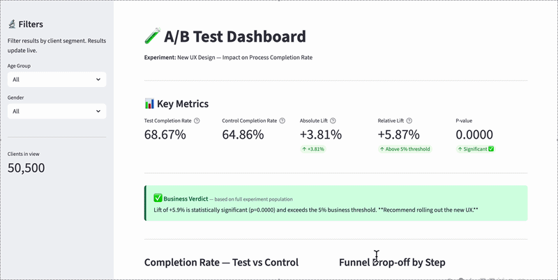

# 🧪 A/B Test Analysis — UX Completion Rate
[](https://your-app.streamlit.app)

---

Author: 
Ngoc Ha Nguyen - [Linkedin](https://www.linkedin.com/in/hannah-ngocha-nguyen/)



[Open Streamlit Live Dashboard](https://ux-ab-test-analysis.streamlit.app/)

---

## 🎯 Project Summary

**Problem:** A financial services company redesigned a multi-step digital onboarding flow and needed to determine whether the new UX improved completion rates enough to justify the rollout cost.

**Data:** Three sources — client demographics (age, balance, tenure, gender), digital funnel behavior (event-level visits across a 5-step process), and experiment group assignment. The experiment ran for 97 days.

**Method:** A/B test analysis using a two-proportion z-test at the client level. Completion is defined as a client reaching the `confirm` step at least once during the test period.

**Outcome:** See Results section below.

---

## 📐 Why `client_id` as the Analysis Unit?

The experiment was **randomized at `client_id` level**, so the analysis must aggregate to the same level of granularity. Each client can generate multiple `visitor_id` entries (average ~2 accounts) and many `visit_id` events across the test period.

Using `visitor_id` or `visit_id` as the analysis unit would treat correlated observations from the same client as statistically independent — artificially inflating the effective sample size, narrowing confidence intervals, and overstating significance. Critically, completion rate is a **user-level outcome**: what matters is whether a person completed the process, not how many sessions it took. `client_id` is therefore both the statistically correct and the most business-meaningful unit of analysis.

> Reference: Kohavi, Tang & Xu — *Trustworthy Online Controlled Experiments* (2020), Chapter 14.

---

## 📊 Results

| Metric | Value |
|---|---|
| Test completion rate | 68.67% (18,518 / 26,968) |
| Control completion rate | 64.86% (15,262 / 23,532) |
| Absolute lift | +3.81 pp |
| Relative lift | +5.87% |
| Z-statistic | 9.08 |
| P-value | < 0.0001 |
| 95% Confidence interval (diff) | [+2.99 pp, +4.63 pp] |
| Cohen's h | 0.081 (Small effect) |
| Statistically significant? | Yes (α = 0.05) |
| Exceeds 5% business threshold? | Yes |
| **Decision** | **Recommend full rollout** |

[Full analysis notebooks here](https://github.com/ngocha2811/ux-ab-test-analysis/tree/main/notebooks)

---

### Business Narrative

The redesigned onboarding flow cleared both bars: statistically significant (p < 0.0001) and above the 5% business threshold at +5.87% relative lift. Effect size is small by Cohen's conventions — typical for mature digital products — but applied to Vanguard's full client base, even a 3.8 pp gain translates to tens of thousands of additional completed onboardings per quarter. 

Recommendation: full rollout.

---

## 🔬 Methodology

**Experiment design**
- Randomization unit: `client_id`
- Analysis unit: `client_id`
- Test type: Two-sided two-proportion z-test
- Significance level: α = 0.05
- Business threshold: relative lift > 5%

**Validity checks**
- Sample Ratio Mismatch (SRM) test — confirms randomization was executed correctly
- Covariate balance checks across age, balance, tenure, gender — confirms groups are comparable

**Funnel definition**
```
start → step_1 → step_2 → step_3 → confirm
```
A client is counted as having reached a step if their maximum step across all visits reached that level.

**Tools**
`pandas` · `numpy` · `scipy` · `statsmodels` · `matplotlib` · `seaborn` · `plotly` · `streamlit`

---

## 📋 Notebooks

| # | Notebook | Description |
|---|---|---|
| 01 | [Data Loading & Cleaning](notebooks/01_data_loading_and_cleaning.ipynb) | Merging sources, deduplication, building client-level analysis table |
| 02 | [EDA & Client Profiling](notebooks/02_eda_and_client_profiling.ipynb) | SRM check, covariate balance validation |
| 03 | [Funnel Analysis](notebooks/03_funnel_analysis.ipynb) | Step-by-step drop-off, Test vs Control |
| 04 | [Statistical Testing & Decision](notebooks/04_statistical_testing_and_decision.ipynb) | Z-test, CI, effect size, business verdict |
| 05 | [Segment Analysis](notebooks/05_segment_analysis.ipynb) | Breakdowns by age, balance tier, gender |

---

## 📁 Project Structure

```
.
├── data/                          # Raw input files (not tracked)
├── output/                        # Processed data
│   ├── df_analysis_client_level.csv
│   ├── df_web_clean.csv
│   ├── results_summary.json
│   └── *.png                      # Charts
├── notebooks/  
│   ├── 01_data_loading_and_cleaning.ipynb
│   ├── 02_eda_and_client_profiling.ipynb
│   ├── 03_funnel_analysis.ipynb
│   ├── 04_statistical_testing_and_decision.ipynb
│   ├── 05_segment_analysis.ipynb
├── app.py                         # Streamlit dashboard
└── README.md
```

---

> Data files are not tracked. Place raw CSVs in `data/` and run notebooks 01 → 05 before launching the dashboard.

*Methodology and code only. No confidential Vanguard data or internal systems disclosed.*

